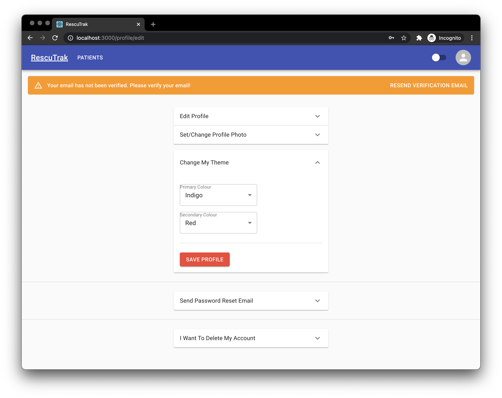

# Animal Rescue Tracking Web App

## What It Is:

This is a small project a friend of mine had the idea of creating. After creating it in PHP and not enjoying it I decided to take it upon myself to create it in React using Firebase for the backend. Some screenshots are below.

## To run it locally:

1. Clone the repo.
2. Setup [Firebase](https://firebase.google.com/) with Firestore, Database, Storage and Authentication(email and password).
3. Add `.env.local` to the root folder and add `REACT_APP_APIKEY` with your Firebase API Key.
4. Update the `src/firebase.js` file shown below.
   
5. Run `npm start` in your terminal from the root folder

## What I Used:

- [React](https://reactjs.org/)
- [Redux](https://redux.js.org/)
- [Firebase](https://firebase.google.com/)
- [Material UI](https://material-ui.com/)
- [Formik](https://formik.org/)
- [Yup](https://github.com/jquense/yup)

## Some Screenshots:

### Patients Table Screen:

### Login Screen:

### Signup Screen:

### Profile Screen:

### Profile Edit/Change Theme Screen:

### Snackbar Example:
